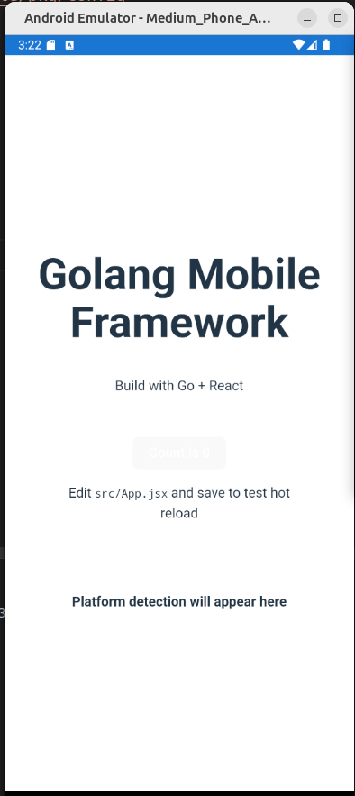

# Golang Mobile Framework

Kerangka kerja untuk membuat aplikasi mobile menggunakan Golang dengan UI dari React, Vue, Svelte, atau Angular. Framework ini menggunakan pendekatan WebView atau Expo untuk membungkus aplikasi web menjadi aplikasi native Android dan iOS.

## Fitur

- 🌐 **Bundle Web ke App** - Mengemas aplikasi web ke dalam aplikasi mobile native
- 🔄 **Hot Reload** - Pengembangan dengan hot reload untuk perubahan cepat
- 👁️ **Preview** - Preview ke simulator, emulator, atau perangkat nyata
- 📱 **Cross-Platform** - Build untuk Android dan iOS dari codebase yang sama

## Preview



## Persyaratan

- Go 1.18 atau yang lebih baru
- Node.js dan npm
- Android SDK (untuk build Android)
- Xcode (untuk build iOS, hanya di macOS)
- ADB (Android Debug Bridge)
- Simulator Android (Android Studio)
- Gradle (untuk build Android)
- CocoaPods (untuk build iOS)
- Simulator iOS (Xcode)
- Xcode Command Line Tools
- Android Studio
- Xcode

## Struktur Proyek

```
golang-browser-mobile/
├── frontend/                # Proyek web (React, Vue, dll)
│   ├── src/                 # Kode sumber frontend web
│   ├── App.js               # Aplikasi React Native untuk Expo
│   ├── app.json             # Konfigurasi Expo
│   ├── index.html           # Template HTML utama untuk web
│   └── package.json         # Konfigurasi npm
├── mobile-shell/            # Wrapper mobile
│   ├── android/             # Shell Android
│   ├── ios/                 # Shell iOS
│   └── assets/              # Assets yang dibundel
├── main.go                  # Program utama Golang
└── README.md                # Dokumentasi
```

## Penggunaan

### Mode Pengembangan dengan Hot Reload

```bash
# Jalankan dalam mode pengembangan WebView
go run main.go -dev

# Jalankan dalam mode pengembangan dengan preview ke emulator/perangkat Android
go run main.go -dev -preview -android [-device=DEVICE_ID]

# Jalankan dalam mode pengembangan dengan preview ke simulator/perangkat iOS
go run main.go -dev -preview -ios [-device=DEVICE_ID]
```

### Build untuk Produksi

```bash
# Build Frontend + Android (WebView)
go run main.go -android

# Build Frontend + iOS (WebView)
go run main.go -ios

# Build dan langsung jalankan di perangkat
go run main.go -android -preview [-device=DEVICE_ID]
```

## Platform Bridge

Framework ini menyediakan bridge untuk komunikasi antara aplikasi web dan platform native:

### Untuk Android

```javascript
// Memanggil fungsi native dari JavaScript
if (window.AndroidBridge) {
  const deviceInfo = window.AndroidBridge.getPlatformInfo();
  window.AndroidBridge.showToast("Hello from JavaScript!");
}
```

### Untuk iOS

```javascript
// Memanggil fungsi native dari JavaScript
if (
  window.webkit &&
  window.webkit.messageHandlers &&
  window.webkit.messageHandlers.iOSBridge
) {
  window.webkit.messageHandlers.iOSBridge.postMessage({
    action: "getPlatformInfo",
  });

  // iOS akan memanggil fungsi setPlatformInfo yang Anda definisikan di JavaScript
}
```

## Kustomisasi Framework Web

Anda dapat mengganti React dengan Vue, Svelte, atau Angular dengan menyesuaikan:

1. Frontend dependencies di `package.json`
2. Konfigurasi build
3. Path output build di fungsi `copyBuildToMobile()` pada `main.go`

## Lisensi

MIT
